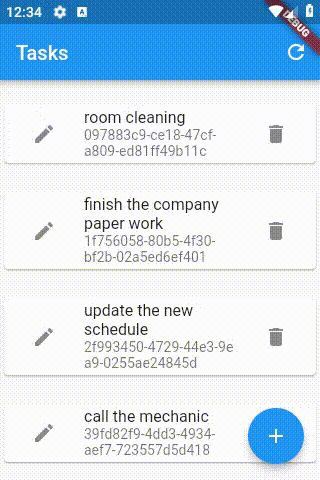

# e005_flutter_hero_animation_on_text_e004base

## Based On e004

- [elrashid-flutter-examples/e004_flutter_listview_crud_app_using_nonsecure_rest_api](https://github.com/elrashid-flutter-examples/e004_flutter_listview_crud_app_using_nonsecure_rest_api)

## Screen Record

## What

- Hero animation on a text filed flutter Task app (e004)

- must run with :

  - [elrashid-flutter-examples/e002-aspcore-rest-api-server-for-flutter](https://github.com/elrashid-flutter-examples/e002-aspcore-rest-api-server-for-flutter)

## Step 1

    Hero(
        tag: taskOpj.guid,
        child: Text(taskOpj.note),
    ),

## Step 2

    Hero(
        tag: widget.taskOpj.guid,
        child: Material(
        child: TextField(
        decoration: InputDecoration(
            border: InputBorder.none,
            ),
        autofocus: true,
        keyboardType: TextInputType.multiline,
        maxLines: null,
        controller: _noteController),
            ),
    ),

## Step 3

    onPressed: () => Navigator.push(
        context,
        MaterialPageRoute(
        builder: (context) {
            return TaskEditPageWidget(
            taskOpj: taskOpj,
            notifyParent: notifyParent,
            );
        },
        ),
    ),

## Ref

- [Hero (Flutter Widget of the Week) - YouTube](https://www.youtube.com/watch?v=Be9UH1kXFDw)

- [Hero Animations - Flutter](https://flutter.dev/docs/development/ui/animations/hero-animations)

- [Search · hero](https://github.com/flutter/flutter/search?p=2&q=hero&unscoped_q=hero)

## issues

 - [No Material widget found error but Scaffold present · Issue #28326 · flutter/flutter](https://github.com/flutter/flutter/issues/28326)

